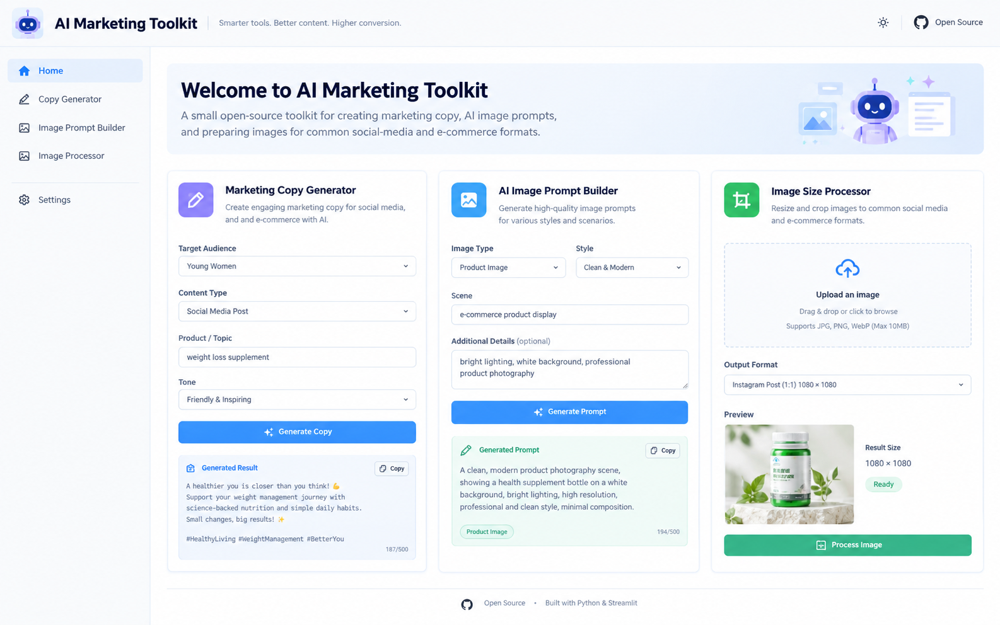

# AI Marketing Toolkit

A small open-source toolkit for creating marketing copy, AI image prompts, and preparing images for common social-media and e-commerce formats.

## Demo



## Features

- Marketing copy generator with reusable templates
- AI image prompt builder
- Image resize/crop helper
- Streamlit web interface
- No vendor lock-in: the copy and prompt modules work without an external AI API

## Quick start

```bash
python -m venv .venv
# Windows
.venv\Scripts\activate
# macOS/Linux
source .venv/bin/activate

pip install -r requirements.txt
streamlit run app.py
```

Then open the local URL shown by Streamlit.

## Project structure

```text
ai-marketing-toolkit/
├── app.py
├── requirements.txt
├── LICENSE
├── .gitignore
├── modules/
│   ├── __init__.py
│   ├── copywriter.py
│   ├── prompt_generator.py
│   └── image_tools.py
└── examples/
    └── demo.md
```

## Roadmap

- Add more copy templates
- Add brand voice presets
- Add batch image processing
- Add optional LLM provider adapters
- Add automated tests

## License

MIT
